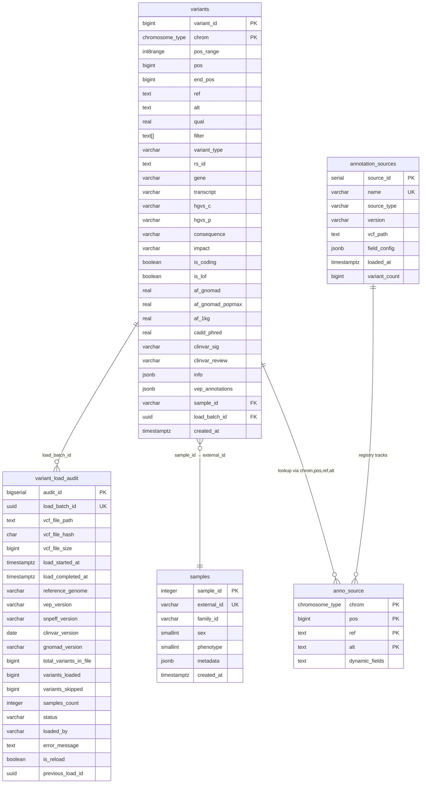

# Database Schema

## Entity Relationship Diagram

## Tables

### variants
Main storage for VCF variant records. Partitioned by chromosome (`PARTITION BY LIST (chrom)`) for query performance. Human genome mode creates partitions for chr1-22, chrX, chrY, chrM, plus a default partition.

### variant_load_audit
Audit trail tracking each VCF file load operation. Records file checksums, variant counts, annotation versions, and load status for compliance and debugging.

### samples
Sample metadata including family relationships, sex, and phenotype. Referenced by variants via `external_id`.

### annotation_sources
Registry of loaded annotation sources (gnomAD, ClinVar, etc.). Stores field configurations as JSONB for dynamic table creation.

### anno_{source_name}
Dynamic tables created per annotation source. Each contains (chrom, pos, ref, alt) as composite primary key plus source-specific fields. Used for variant annotation lookups.
