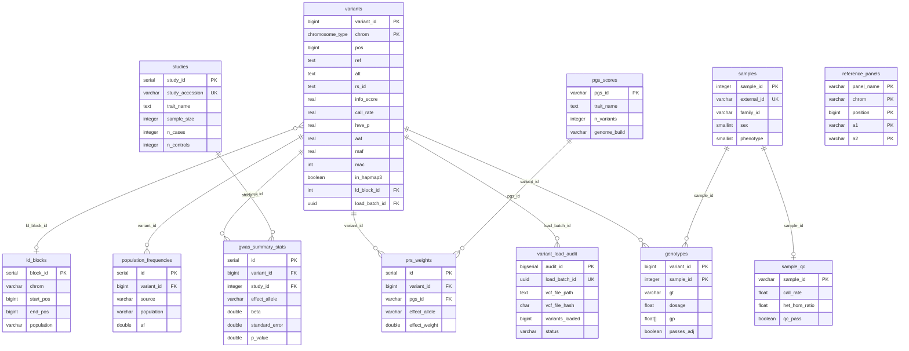

# Database Schema

This document provides an overview of the vcf-pg-loader database schema. For detailed documentation of each table, see the [schema reference](./schema/index.md).

## Entity Relationship Diagram



## Table Categories

### Core Tables

| Table | Description | Documentation |
|-------|-------------|---------------|
| `variants` | Main variant storage, partitioned by chromosome | [Schema Overview](./schema/index.md) |
| `variant_load_audit` | Load tracking and validation | [Schema Overview](./schema/index.md) |
| `samples` | Sample metadata | [Schema Overview](./schema/index.md) |

### PRS Research Tables

| Table | Description | Documentation |
|-------|-------------|---------------|
| `pgs_scores` | PGS Catalog score metadata | [PRS Tables](./schema/prs-tables.md) |
| `prs_weights` | Per-variant PRS effect weights | [PRS Tables](./schema/prs-tables.md) |
| `studies` | GWAS study metadata | [GWAS Tables](./schema/gwas-tables.md) |
| `gwas_summary_stats` | GWAS association results (GWAS-SSF) | [GWAS Tables](./schema/gwas-tables.md) |

### Reference Data

| Table | Description | Documentation |
|-------|-------------|---------------|
| `reference_panels` | HapMap3 and other SNP sets | [Reference Tables](./schema/reference-tables.md) |
| `ld_blocks` | LD block definitions (Berisa & Pickrell) | [Reference Tables](./schema/reference-tables.md) |

### Individual-Level Data

| Table | Description | Documentation |
|-------|-------------|---------------|
| `genotypes` | Per-sample genotypes with dosages | [Genotypes Tables](./schema/genotypes-tables.md) |
| `population_frequencies` | Multi-ancestry allele frequencies | [QC Tables](./schema/qc-tables.md) |

### Quality Control

| Table | Description | Documentation |
|-------|-------------|---------------|
| `sample_qc` | Per-sample QC metrics | [QC Tables](./schema/qc-tables.md) |

### Materialized Views

| View | Description | Documentation |
|------|-------------|---------------|
| `prs_candidate_variants` | Pre-filtered PRS-ready variants | [Views](./schema/views.md) |
| `variant_qc_summary` | Aggregate QC statistics | [Views](./schema/views.md) |
| `chromosome_variant_counts` | Per-chromosome counts | [Views](./schema/views.md) |
| `sample_qc_summary` | Batch-level QC summary | [Views](./schema/views.md) |

## Partitioning

### variants table (List Partitioning)

```sql
PARTITION BY LIST (chrom)
```

- `variants_chr1` through `variants_chr22`
- `variants_chrx`, `variants_chry`, `variants_chrm`
- `variants_default`

### genotypes table (Hash Partitioning)

```sql
PARTITION BY HASH (sample_id)
```

- 16 partitions: `genotypes_p0` through `genotypes_p15`

## SQL Functions

| Function | Description |
|----------|-------------|
| `hwe_exact_test(n_aa, n_ab, n_bb)` | Hardy-Weinberg equilibrium p-value |
| `af_from_dosages(dosages[])` | Allele frequency from dosage array |
| `n_eff(n_cases, n_controls)` | Effective sample size |
| `alleles_match(ref1, alt1, ref2, alt2)` | Allele harmonization |

## Detailed Documentation

See the [Schema Reference](./schema/index.md) for complete table definitions, indexes, and usage examples.
