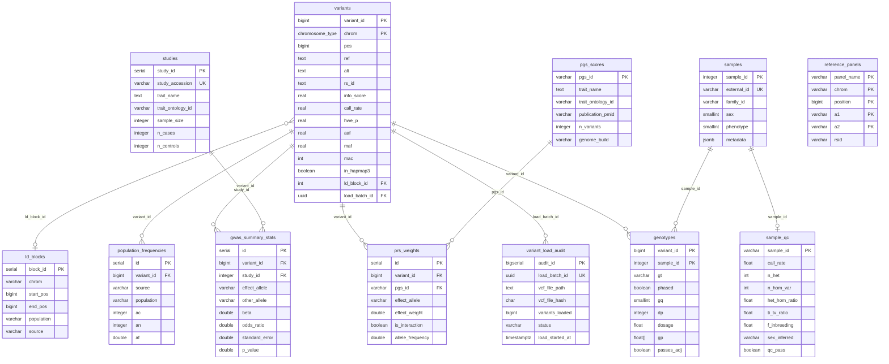

# Database Schema Overview

vcf-pg-loader uses a purpose-built PostgreSQL schema optimized for Polygenic Risk Score (PRS) research workflows. The schema supports:

- High-performance variant storage with chromosome partitioning
- GWAS summary statistics in GWAS-SSF standard format
- PGS Catalog scoring file integration
- Reference panels (HapMap3) and LD block definitions
- Multi-ancestry population frequencies
- Individual-level genotypes with dosage support
- Comprehensive sample and variant QC metrics

## Entity Relationship Diagram



## Table Categories

### Core Variant Data
| Table | Purpose | Partitioning |
|-------|---------|--------------|
| [`variants`](./index.md#variants) | Primary variant storage | LIST by chromosome |
| [`variant_load_audit`](./index.md#variant_load_audit) | Load tracking and validation | None |
| [`samples`](./index.md#samples) | Sample metadata | None |

### PRS Research Tables
| Table | Purpose | Documentation |
|-------|---------|---------------|
| [`pgs_scores`](./prs-tables.md#pgs_scores) | PGS Catalog score metadata | [PRS Tables](./prs-tables.md) |
| [`prs_weights`](./prs-tables.md#prs_weights) | Per-variant PRS effect weights | [PRS Tables](./prs-tables.md) |
| [`studies`](./gwas-tables.md#studies) | GWAS study metadata | [GWAS Tables](./gwas-tables.md) |
| [`gwas_summary_stats`](./gwas-tables.md#gwas_summary_stats) | GWAS association results | [GWAS Tables](./gwas-tables.md) |

### Reference Data
| Table | Purpose | Documentation |
|-------|---------|---------------|
| [`reference_panels`](./reference-tables.md#reference_panels) | HapMap3 and other SNP sets | [Reference Tables](./reference-tables.md) |
| [`ld_blocks`](./reference-tables.md#ld_blocks) | LD block definitions | [Reference Tables](./reference-tables.md) |

### Individual-Level Data
| Table | Purpose | Documentation |
|-------|---------|---------------|
| [`genotypes`](./genotypes-tables.md#genotypes) | Per-sample genotype calls | [Genotypes Tables](./genotypes-tables.md) |
| [`population_frequencies`](./qc-tables.md#population_frequencies) | Multi-ancestry allele frequencies | [QC Tables](./qc-tables.md) |

### Quality Control
| Table | Purpose | Documentation |
|-------|---------|---------------|
| [`sample_qc`](./qc-tables.md#sample_qc) | Per-sample QC metrics | [QC Tables](./qc-tables.md) |

### Materialized Views
| View | Purpose | Documentation |
|------|---------|---------------|
| [`prs_candidate_variants`](./views.md#prs_candidate_variants) | Pre-filtered PRS-ready variants | [Views](./views.md) |
| [`variant_qc_summary`](./views.md#variant_qc_summary) | Aggregate QC statistics | [Views](./views.md) |
| [`chromosome_variant_counts`](./views.md#chromosome_variant_counts) | Per-chromosome counts | [Views](./views.md) |
| [`sample_qc_summary`](./views.md#sample_qc_summary) | Batch-level QC summary | [Views](./views.md) |

## Partitioning Strategy

### Chromosome Partitioning (variants table)

The `variants` table uses PostgreSQL list partitioning by chromosome for optimal query performance:

```sql
PARTITION BY LIST (chrom)
```

Partitions created for human genome:
- `variants_chr1` through `variants_chr22`
- `variants_chrx`, `variants_chry`, `variants_chrm`
- `variants_default` (catch-all)

Benefits:
- Partition pruning eliminates irrelevant chromosomes from queries
- Parallel index creation per partition
- Independent VACUUM and maintenance per partition

### Hash Partitioning (genotypes table)

The `genotypes` table uses hash partitioning by `sample_id`:

```sql
PARTITION BY HASH (sample_id)
```

16 partitions (`genotypes_p0` through `genotypes_p15`) enable:
- Parallel query execution across partitions
- Even distribution of data regardless of sample count
- Efficient per-sample queries

## Indexing Strategy

### GiST Indexes for Range Queries

```sql
CREATE INDEX idx_variants_region ON variants
    USING GiST (chrom, pos_range);
```

Enables efficient region queries like:
```sql
WHERE chrom = 'chr1' AND pos_range @> 12345::bigint
```

### Partial Indexes for Common Filters

```sql
CREATE INDEX idx_gwas_pvalue ON gwas_summary_stats (p_value)
    WHERE p_value < 5e-8;

CREATE INDEX idx_genotypes_adj ON genotypes (variant_id)
    WHERE passes_adj = TRUE;

CREATE INDEX idx_popfreq_rare ON population_frequencies (population, af)
    WHERE af < 0.01;
```

### Covering Indexes

```sql
CREATE INDEX idx_variants_gene ON variants (gene)
    INCLUDE (pos, ref, alt, impact);
```

## SQL Functions

The schema includes custom SQL functions for PRS workflows:

| Function | Purpose |
|----------|---------|
| `hwe_exact_test(n_aa, n_ab, n_bb)` | Hardy-Weinberg equilibrium p-value |
| `af_from_dosages(dosages[])` | Allele frequency from dosage array |
| `n_eff(n_cases, n_controls)` | Effective sample size calculation |
| `alleles_match(ref1, alt1, ref2, alt2)` | Allele harmonization with strand flip |

## Next Steps

- [PRS Tables](./prs-tables.md) - PGS scores and weights
- [GWAS Tables](./gwas-tables.md) - Summary statistics schema
- [Reference Tables](./reference-tables.md) - HapMap3 and LD blocks
- [Genotypes Tables](./genotypes-tables.md) - Individual-level data
- [QC Tables](./qc-tables.md) - Quality control metrics
- [Materialized Views](./views.md) - Pre-computed query results
